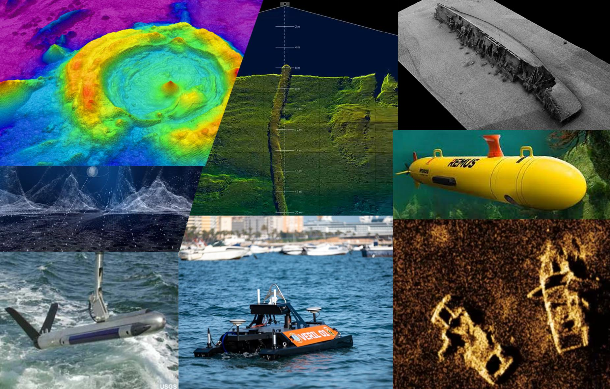

# **Awesome Hydrospatial**

An awesome and curated list of applications, tools, and documentation aimed to "map" the publicly available resources for the Ocean Mapping community.

Contributions are welcome. Add links through pull requests or create an issue to start a discussion.

  
  - [**Free and Open Software for Ocean Mapping (FOSSOM)**](#free-and-open-software-for-ocean-mapping-fossom)
    - [Survey planning and preparations](#survey-planning-and-preparations)
    - [Data acquisition](#data-acquisition)
    - [Hydrographic data processing](#hydrographic-data-processing)
      - [*Specialized tools for multibeam backscatter processing*](#specialized-tools-for-multibeam-backscatter-processing)
    - [Quality Control / Quality Assurance](#quality-control--quality-assurance)
    - [Geospatial analysis and generation of derived products](#geospatial-analysis-and-generation-of-derived-products)
    - [Data management and dissemination](#data-management-and-dissemination)
    - [Enhanced visualization](#enhanced-visualization)
    - [Coding scritps](#coding-scritps)
      - [Python](#python)
      - [R programming language](#r-programming-language)
      - [Scripts and tools in other languages](#scripts-and-tools-in-other-languages)
    - [Licenced but free tools](#licenced-but-free-tools)
    - [Other interesting sites listing free resources](#other-interesting-sites-listing-free-resources)
  - [Commercial hydrographic software](#commercial-hydrographic-software)
  - [Other resources](#other-resources)
    - [Reference documentation](#reference-documentation)
    - [Hydrographic datasets online](#hydrographic-datasets-online)
    - [Magazines and journals](#magazines-and-journals)
    - [Youtube and Vimeo channels](#youtube-and-vimeo-channels)
    - [Miscellanea](#miscellanea)
 
 

## **Free and Open Software for Ocean Mapping (FOSSOM)** 
FOSSOM is developed by institutions, researchers and enthusiasts, providing tools that may be used to optimize survey design, troubleshoot and resolve multibeam system performance issues, derive products, and enhance data visualization and dissemination. 

### Survey planning and preparations
- [CruiseTools](https://github.com/simondreutter/cruisetools). A QGIS plugin aimed to simplify and automate common tasks in multibeam surveys

- [MBES Planning Tool](https://github.com/capt-clay10/MBES-Planning-Tool) is simplified GUI based tool to calculate line spacing, coverage and time taken.

- [BathyGlobe GapFiller](https://ccom.unh.edu/vislab/tools/gapfiller/) is a Windows tool designed to support planning for transit and area mapping, providing the latest versions of GEBCO bathymetry as context for planning. Gapfiller complements the online [Bathyglobe](https://bathyglobe.ccom.unh.edu/), an interactive globe to highlight the ocean mapping activities within the Seabed 2030 project.
- [AMUST](https://www.rijkswaterstaat.nl/formulieren/aanvraagformulier-software-hydrografische-normen), A-priori Multibeam Uncertainty Simulation Tool, is a Windows desktop software to compute the vertical and horizontal uncertainties in different operational circumstances. It is based on the error analysis of Hare et al (*Accuracy estimation of Canadian swath  and sweep sounding system, Canadian Hydrographic Service, 1995*)
- [SmartMap](https://www.hydroffice.org/smartmap/main), Sea Mapper's Acoustic Ray Tracing Monitor and Planning, is an online app within the [Hydroffice](https://www.hydroffice.org/) framework that provides tools to evaluate the impact of oceanographic temporal and spatial variability on hydrographic surveys.  
- [VDatum](https://vdatum.noaa.gov/) is a free Java tool designed to vertically transform geospatial data among a variety of tidal, orthometric and ellipsoidal vertical datums, allowing users to convert their data from different horizontal/vertical references into a common system and enabling the fusion of diverse geospatial data in desired reference levels. VDatum covers U.S. coastal areas out to 25 nautical miles from land.
### Data acquisition
- [Sound Speed Manager](https://www.hydroffice.org/soundspeed/) is a Python-based tool within the [Hydroffice](https://www.hydroffice.org/) framework that presents an intuitive, but feature-rich interface to guide the user through the processing steps required to deliver an enhanced sound speed profile to the acquisition system. 

### Hydrographic data processing

- [MB-system ](https://github.com/dwcaress/MB-System), is an open source software consisting of a set of programs to manipulate, process, list, or display bathymetry and backscatter imagery data derived from multibeam, interferometry, and sidescan sonars. MB-System is written in the C and C++ programming languages, and is delivered in packaged distributions for Linux and MacOS, as well as in the form of Docker containers. It can be run on Windows 10/11 machines by using the Windows Subsystem for Linux feature. 
- [NEANIAS Bathymetry Mapping from Acoustic Data service](https://www.neanias.eu/index.php/discover-the-neanias-services/underwater/26-services/493-u1-bat-service-2) (UW-BAT) is an online platform delivering an advanced user-friendly, cloud-based version of MB-System through Jupyter notebooks with additional functionalities.
- [GLOBE](https://www.seanoe.org/data/00592/70460/), GLobal Oceanographic Bathymetry Explorer,  is a Java application for processing and displaying raw multibeam and oceanographic data within a 3D environment represented as a globe. Kongsberg "all" and "kmall" formats as well as Teledyne "sk7" can be processed in GLOBE, along with IFREMER/SHOM raw multibeam format. Processed data come into [SONAR-netCDF4](https://github.com/ices-publications/SONAR-netCDF4) open format.   

- [OpenSideScan](https://opensidescan.cidco.ca/) is a Windows software to visualize and manipulate sidescan sonar imagery files, investigate seabed features, and create underwater inventories. OpenSideScan is free and open source, with community support on GitHub, but also is commercialized in custom versions with extra features and commercial support.

- [Kluster](https://github.com/noaa-ocs-hydrography/kluster) is a Python-based software that provides a fully open source hydrographic processing package to produce accessible bathymetry and backscatter products in support of ocean mapping. Kluster runs either on a GUI and through command line, and provides a wide arrange of options for exporting processed data.
- [Sonar2MAT](https://cmst.curtin.edu.au/products/sonar2mat-software/) is a program that converts selected sonar files to MATLAB (.mat) data format to allow advanced data analysis and algorithm development. The convertor supports Reson (s7k), Kongsberg (.all, .wcd), Odom/Imagenex (.837, .83b and .83p), Generic Sensor Format (.gsf), Geoswath swamp and raw files (.swp, .rdf), MSTIFF (.mst) and eXtended Triton Format (.xtf).
- [CloudCompare](https://www.danielgm.net/cc/), is a 3D point cloud processing software. It can also handle triangular meshes and calibrated images. Although is commonly used in laser scanner and LIDAR data processing and photogrammetry, it is being utilized used for high definition 3D structure reconstruction from multibeam data.   

#### *Specialized tools for multibeam backscatter processing*
  - [SonarScope](https://www.seanoe.org/data/00766/87777/) is a Matlab-based software providing a high-performance environment for the analysis of multibeam echosounders and side scan sonars. In addition SonarScope is a reference tool for the treatment of bottom reflectivity by Ifremer and other marine resarch organizations.
  - [Stormix ](https://www.hydroffice.org/stormfix/) is a set of tools within [Hydroffice](https://www.hydroffice.org/) to reduce artifacts in acoustic backscatter data. It also allows displaying raw multibeam data. Currently Kongsberg "all" and "wcd" formats are supported.
  - [Iskaffe](https://github.com/alexschimel/Iskaffe) is an app to help assess the quality of the seafloor backscatter data acquired by multibeam echosounders. Iskaffe uses the CoFFee multibeam data processing toolbox. It is coded in MATLAB, but is also available as a standalone application that does not require a MATLAB licence. Currently Iskaffe support Kongsberg "all" and "kmall" formats.
  
  
### Quality Control / Quality Assurance

- [QC Tools](https://www.hydroffice.org/qctools/), found within  [Hydroffice](https://www.hydroffice.org/), assist in the review of various types of data occurring all throughout the ping-to-public process. Accepted data inputs are bathymetric grids, feature files, sounding selections, and directory structures. The output is GIS-layers that alert to the user various parts of their data that might require more attention. 
- [CA Tools](https://www.hydroffice.org/catools/main), another component of the [Hydroffice](https://www.hydroffice.org/) framework, assist in the assessment of the adequacy of nautical charts. Accepted data inputs are ENCs, bathymetric grids, and sounding selections. The output is GIS-layers that alert to the user various parts of their data that might require more attention
- [QAX](https://www.ausseabed.gov.au/QAX), coded in Python, facilitates quality assurance (QA) of multibeam echosounder data by standardising QA outputs and performing a robust QA. QAX integrates several tools, namely MATE, MBESGC and FinderGC. In a future release QAX will include QC tools [Hydroffice](https://www.hydroffice.org/)
- [Multibeam Advisory Committee Tools](https://github.com/MBAdv/multibeam_tools) are a set of Python tools for evaluating multibeam system installation and performance during Sea Acceptance Trials or Quality Assessment Testing.The tools are intended to simplify the multibeam evaluation process with a more user-friendly and flexible interface. The MAC tools are mostly intended for Kongsberg MBES.
- [CCOM MBES performance](https://vislab-ccom.unh.edu/~roland/acoustics/mbes_performance.html) is an online tool for assessing theorical the performance of an MBES from a set of given parameters.
- [Hydroffice](https://www.hydroffice.org/) is an open-source collaborative effort led by the Center for Coastal and Ocean Mapping to develop a research software environment with applications to facilitate all phases of the ping-to-chart process: facilitate data acquisition, automate and enhance data processing, and improve hydrographic products.
- [Pydro](https://svn.pydro.noaa.gov/Docs/html/Pydro/universe_overview.html) is a suite of software tools used to support hydrography and cartography. It is (almost exclusively) built from open source components as well as public domain custom developed software. Pydro is maintained by the Hydrographic Systems and Technology Branch (HSTB) to support NOAA operations (aiding our survey fleet) and is now made available for public use. Hydroffice tools are included within Pydro.
- [Pure File Magic](http://pfmabe.software/) is Area Based editor to  view and edit hydro, bathy and topo data in 3D. PFMABE ingests most major sonar and lidar data types and allows for quick and easy analysis, cleaning and quality control.

### Geospatial analysis and generation of derived products 
- [QGIS](https://www.qgis.org/) is a a reference cross-platform desktop geographic information system (GIS) application that supports viewing, editing, printing, and analysis of geospatial data. The numerous community of users support QGIS. Plugins are developed by independent organizations and developers, providing QGIS additional functionalities.
- [Raster Attribute Table QGIS Plugin](https://github.com/noaa-ocs-hydrography/qgis-raster-attribute-table-plugin) allows the user to display and edit Raster Attribute Tables (RATs) for discrete rasters using paletted/unique-values renderer. Useful for Geographic Object-Based Image Analysis (GEOBIA) in seafloor classication.

- [Whitebox Tools](https://www.whiteboxgeo.com/) (WBT) is a package for geospatial analysis that can be embedded into other software in order to facilitate building other types of applications.WBT contains over 500 geospatial analysis tools.
- [GRASS GIS](https://grass.osgeo.org/) is a multiplatform GIS software suite used for geospatial data management and analysis, image processing, producing graphics and maps, spatial and temporal modeling, and visualizing. It comes with a temporal framework for advanced time series processing and a Python API for rapid geospatial programming.
  
### Data management and dissemination
- [OpenRVDAS](https://github.com/OceanDataTools/openrvdas),  Open Research Vessel Data Acquisition System, is a software framework used for building custom data acquisition systems. OpenRVDAS target audiences are oceanographic research vessel operators and operators of other science-related platforms that have the need to record streaming data. OpenRVDAS is capable of reading data records from serial ports and network-aware sensors, optionally modifying those data records and streaming either the result to one or more destinations, including logfiles, network ports, databases, etc.

- [CruisePack](https://www.ncei.noaa.gov/products/cruisepack)  is a data packaging and metadata gathering software tool to simplify submission of cruise-based data. CruisePack has a simple interface to control packager operation and metadata entry. Once the metadata entry is complete, data packaging is automatic. Although CruisePack is intended to comply with NCEI, it can be easily adapted for other organizations since it uses  a SQLite database under the hood.

### Enhanced visualization
- The [CCOM Data Visualization and Interaction Tools](https://ccom.unh.edu/vislab/tools/), developed at the Visualization Laboratory, include VR Point Cloud Editor, Point Cloud Plugin for Unity, BAG Loader Unity Plugin, 3d Flight Unity Script and Coral Viz WebGl Viewer
 - [CesiumJS](https://cesium.com/)  is a JavaScript library for creating 3D globes and 2D maps in a web browser without any plugins. It uses WebGL for hardware-accelerated graphics, and is cross-platform, cross-browser, and tuned for time-dynamic data visualization. 
- [TerriaJS](https://terria.io/) is a library based on CesiumJS for building rich, web-based geospatial data explorers, used to drive  Digital Earth Australia Map and NSW Spatial Digital Twin , among many any others. It falls back to 2D with Leaflet on systems that can't run CesiumJS.
- [Qgis2threejs](https://plugins.qgis.org/plugins/Qgis2threejs/) is a QGIS plugin to visualize DEM, vector data and point cloud data in 3D on web browsers. You can build various kinds of 3D objects and generate files for web publishing in simple procedure. In addition, you can save the 3D model in glTF format for 3DCG or 3D printing.
- [Aerialod](https://ephtracy.github.io/index.html?page%3Daerialod#%3A~%3Atext%3D0.1%29%2Cand%2016-bit%20png%20images.) is a is a simple and interactive path tracer that allows 3D rendering from raster DEM.

### Coding scritps

#### Python 
- [Bathycube](https://github.com/noaa-ocs-hydrography/bathycube) is a Python implementation of the CUBE module, Combined Uncertainty and Bathymetry Estimator. It only contains the cube grid/node objects, the original library included other data structures that were not translated here.
- [gsfpy](https://github.com/UKHO/gsfpy) is the Python wrapper for the C implementation of the Generic Sensor Format library, developed at UKHO. Only for Linux.
- [valschmidt/kmall](https://github.com/valschmidt/kmall) is a  python reader for the Kongsberg KMALL file format.
- [ausseabed/kmall](https://github.com/ausseabed/kmall) is a fork of [valschmidt/kmall](https://github.com/valschmidt/kmall) by the Australian national seabed mapping coordination program (Ausseabed).
- [merge svp ](https://github.com/ausseabed/merge-svp) is a command line utility for merging Sound Velocity Profiles into single file format supported by Teledyne CARIS.
- [pyxtf](https://github.com/oysstu/pyxtf) is a python library for reading and writing eXtended Triton Format (XTF) files.
- [NOAA OCS driver](https://github.com/noaa-ocs-hydrography/drivers/tree/main/HSTB/drivers) is a collection of Python file readers and supporting modules for hydrographic data access.
- [CCOM-JHC common data readers ](https://github.com/CCOMJHC/common_data_readers) is a repository for common multibeam data parsers and readers (all/kmall/s7k).
- [survey2ssdm ](https://github.com/pktrigg/survey2ssdm) imports a hydrographic survey to an opensource geopackage using the SSDM 2.0 schema
- [pyAllConditioner](https://github.com/pktrigg/pyAllConditioner) is a
python module to read and write a Kongsberg .ALL file making modifications along the way.
- [echopype ](https://github.com/OSOceanAcoustics/echopype) is a package built to enable interoperability and scalability in ocean sonar data processing. Currently supporting SIMRAD EK60 file format.
- [verde ](https://github.com/fatiando/verde)  is a Python library for processing spatial data (bathymetry, geophysics surveys, etc) and interpolating it on regular grids.
- [pyCascadia](https://github.com/UCL/pyCascadia) is implementation of GEBCO cookbook remove-restore and other cleaning of topography/bathymetry by using pyGMT.
- [cudem ](https://github.com/ciresdem/cudem) contains scripts and programs for use in generating and processing Digital Elevation Models.

- [Sounding Selection](https://github.com/NoelDyer/Sounding-Selection) is an script to improve label-based generalization of bathymetry data for hydrographic sounding selection.
- [Control de Calidad](https://github.com/monocilindro/Awesome-Hydrospatial/blob/main/resources/Control_Calidad.ipynb) is a Jupyter Notebook with code to help sounding validation implementing the triangulation algorithmn by Masetti et al, 2018.
- [Interactive-MBES-processing](https://github.com/SophieHCU/Interactive-MBES-processing) is a tool based on Python and Jupyter Notebook for interactive processing of Kongsberg MBES bathymetry and backscatter data.
- [Ocean Data Science](https://github.com/hydroffice/ocean_data_science) provides an introductory course to Python and Ocean Data Science in the form of Jupyter Notebooks.
- [OpenOceans](https://github.com/jonm3D/OpenOceans) helps you extract and analyze bathymetry from ICESat-2 lidar data.
- [auvlib](https://github.com/nilsbore/auvlib) is a C++ and python library for reading AUV deployment data files and for processing and visualization of side scan and multibeam data.
  
#### R programming language

- [R package oceanmap](https://github.com/rkbauer/R_Package_oceanmap) provides advanced plot tools for spatial (satellite, bathymetric and topographic) data.
- [Rayshader](https://github.com/tylermorganwall/rayshader) is an open source package for producing 2D and 3D data visualizations in R. rayshader uses elevation data in a base R matrix and a combination of raytracing, hillshading algorithms, and overlays to generate stunning 2D and 3D maps. 
- [MultiscaleDTM ](https://github.com/ailich/MultiscaleDTM) calculates multi-scale geomorphometric terrain attributes from regularly gridded DEM/bathymetry rasters.

#### Scripts and tools in other languages

- [MBES-lib](https://github.com/CIDCO-dev/MBES-lib) is CIDCO multibean function library.
- [CoFFee](https://github.com/alexschimel/CoFFee) is a free and open-source MATLAB library/toolbox for parsing, visualizing, and processing multibeam sonar data processing.
- [Grounds](https://github.com/alexschimel/Grounds) is a free and open-source app to visualize and analyze change between Digital Elevation Models (DEM), that is, bathymetric/topographic grids. Grounds uses the CoFFee multibeam data processing toolbox
- [potree deploy](https://github.com/klakar/potree_deploy) provides scripts and files to build a barebones deployment package with the Potree viewer for EPT point clouds. Quite helpful to visualize  point clouds generated from Kluster in a web  browser.

- [Patton's GRASS GIS and Geomatics Toolbox](https://github.com/ericrpatton/GRASS-GIS-and-Geomatics-Toolbox). This is a collection of GIS tools and bash scripts centered on using open source geomatics tools to solve various data formatting, visualization, and geoprocessing tasks in the context of seafloor swath bathymetry data processing.

- [Ausseabed processing-pipeline](https://github.com/ausseabed/processing-pipeline) contains both the infrastructure-as-code and application for Ausseabed processing pipeline, including MBsystem, PDAL and CARIS scripts.
- [Pingo ](https://github.com/PingoPlatform/Pingo) is a collection of code, tutorials and case studies for Marine Habitat Mapping, focused in backscatter analysis and machine learning techniques.
- [Marine Geospatial Ecology Tools](https://mgel.env.duke.edu/mget/)  is a free, open-source geoprocessing ArcGIS 10.x toolbox that can help you solve a wide variety of marine research, conservation, and spatial planning problems.
- [ArcGIS Code Sharing](https://codesharing.arcgis.com/) is an ESRI site to search, browse and use code, scripts , models and more.

### Licenced but free tools
- [Ocean Tools: Marine Science](https://t.co/dMAZNAEK21) is an Android to develop useful tools for use in the planning and development of oceanographic surveys. It is not about providing tools that perform large calculations or processing, but rather Ocean Tools is focused on algorithms to perform small calculations on a day-to-day basis during the planning and execution of oceanographic campaigns.
- [Mirone ](http://joa-quim.pt/mirone/) is a MATLAB-based framework tool that allows the display and manipulation of a large number of grid/images formats through its interface with the GDAL library. Its main purpose is to provide users with an easy-to-use graphical interface to manipulate GMT grids. Joaquim also provides [MBsystem for Windows](http://joa-quim.pt/mirone/downloads/gmt.html), a lighter version of MBsystem with no GUI apps.

- [CMST-GA MB Process](https://cmst.curtin.edu.au/products/multibeam-software/)i s a proprietary backscatter data processing tool coded in Matlab and developed and used by Curtin University Centre for Marine Science and Technology (CMST) and Geoscience Australia (GA) researchers to process Kongsberg and Reson MBES data
- [Hydrobib](https://hydrocharting.com/hydrobib/) is a freeware collection of survey utilities, meant to be used as a “knowledge database” for placing various information and “hydrographic tools” for classroom sonar/hydrography training etc.
- [DORIS](https://www.doris-svp.org/) displays and processes physical data (salinity, temperature, velocity) issued from sensors and/or databases. The generated sound velocity profiles can be exported either to a sonar system for real-time application or to a post-processing software suite.
- [Ocean Data View ](https://odv.awi.de/) (ODV) is a software package for the interactive exploration, analysis and visualization of oceanographic and other geo-referenced profile, time-series, trajectory or sequence data.
- [WebTide](https://www.bio-iob.gc.ca/science/research-recherche/ocean/webtide/index-en.php)  is a modelling tool to predict tides in Canada’s Atlantic, Arctic, and Pacific oceans. [WebTide Global Data](https://www.bio-iob.gc.ca/science/research-recherche/ocean/webtide/global-mondiale-en.php) provides tide prediction in a global scale
- [Geoscience Australia Seabed Morphology Mapping Tools](https://www.ausseabed.gov.au/resources/morphology-tool) (GA-SaMMT) are a ArcGIS Pro Python toolbox using Python 3+ to map 10 bathymetric high and eight bathymetric low features according to the definitions of Dove et al. (2020).
- [Benthic Terrain Modeler](https://coast.noaa.gov/digitalcoast/tools/btm.html) is an ARGIS 10.X toolboxto classify the benthic environment using bathymetric data. Users can create grids of bathymetric position index (BPI) and standardized BPIs, slope, and terrain ruggedness. Additionally, two terrain classification tools can create zone and structure classifications for defining the relationships between them.
- [Relief Visualization Toolbox](https://iaps.zrc-sazu.si/en/rvt#v) is developed to help scientist visualize raster elevation model datasets. We narrowed down the selection to include techniques that have proven to be effective for identification of small scale features. 

### Other interesting sites listing free resources
- [OSHydro](https://www.oshydro.org/). The Open Source Hydro (OSHydro) is an initiative foster collaboration and open source software development within the hydrographic surveying and ocean mapping community.
- [FOSS for Hydrographic Programmers](https://github.com/wrenoud/hydrographic-libraries) provides a list of libraries useful for hydrographic data processing
- [qa4mbes-software-list](https://github.com/monocilindro/qa4mbes-software-list) provides a list of Bathymetry Survey Software Tools
- [Awesome Geospatial](https://github.com/sacridini/Awesome-Geospatial) is a long list of geospatial analysis tools. Geospatial analysis, or just spatial analysis, is an approach to applying statistical analysis and other analytic techniques to data which has a geographical or spatial aspect.

## Commercial hydrographic software
- [QPS](https://qps.nl/) provides software for the whole hydrographic workflow , from data collection to piloting, namely Qinsy,Qimera, Fledermaus, Qarto or Qastor.
- [EIVA Navisuite](https://www.eiva.com/) is EIVA´s hydrographic suite that comprehends a wide array of solutions, from sensor setup (NaviPac),  data collection  (NaviScan), editing (Naviedit) or processing (NaviModel) as well as speficic QC/CA and automation tools 
- [Teledyne CARIS](https://www.teledynecaris.com/en/home/) is a producer of hydrographic software for the "ping to chart" workflow, such as HIPS and SIPS, Bathy DataBase, HPD, Onboard360 or CARIS Mira AI, among other.
- [Teledyne PDS](http://www.teledynemarine.com/pds) is a multipurpose software platform and supports a wide range of tasks within Hydrography, Dredge Guidance, Construction Support, Search & Recovery Operations and Port Entrance Monitoring.
- [Beamworx](https://www.beamworx.com/)  is a software engineering and consultancy company focused on the Hydrographic Surveying and Offshore market. The Beamworx suite specializes in the acquisition, processing and integration of single- and multibeam echosounder data.
- [Hypack](https://www.hypack.com/) is a  provider of hydrographic and dredging software worldwide, supporting over 400 different sensors and devices.
- [Echoview](https://echoview.com/) software provides advanced hydroacoustic data processing software for fisheries scientists and environmental managers.

## Other resources

###  Reference documentation
- [International Hydrographic Organization](https://iho.int/iho_pubs/IHO_Download.htm) (IHO) publications.
- [GeoHab](https://geohab.org/publications/), (Marine Geological and Biological Habitat Mapping) provides guidelines for multibeam backscatter and water column data processing.
- [NOAA OCS publications](https://nauticalcharts.noaa.gov/publications/standards-and-requirements.html). The Hydrographic Surveys Specifications and Deliverables (HSSD) details the requirements for hydrographic surveys undertaken either by NOAA field units or by organizations under contract to the NOAA Office of Coast Survey. The  Field Procedures Manual (FPM) provides best practices and standard operating procedures for field units conducting, processing, and generating hydrographic survey deliverables.
- [Australian Multibeam Guidelines](https://australian-multibeam-guidelines.github.io/) provide recommended procedures for survey planning, data acquisition and submission. They are designed for a range of audiences, from those experienced in seafloor mapping using multibeam sonar systems, non-experts who are developing mapping capabilities, and those contracting seafloor mapping surveys using swath systems.
- [Canadian Hydrographic Survey Management Guidelines
](https://www.charts.gc.ca/data-gestion/guidelines-directrices/index-eng.html). The CHS Standards for Hydrographic Surveys is the document that specifies the requirements for hydrographic surveys in order that hydrographic data is collected according to specific standards. This document quantifies the accuracies required, depending on the use of the data.
- [NOAA Center for Ocean Mapping and Innovative Technologies](https://www.marine.usf.edu/comit/resources/) (COMIT) provides links to a handful of helpful documents and websites that help to guide COMIT activities and priorities.
- [IOGP standards](https://www.iogp.org/geomatics/#ssdm). Publications and requirements of the International Association of Oil&Gas Producers.
- [Kongsberg KMALL datagram description](https://www.kongsberg.com/maritime/support/document-and-downloads/software-downloads/). Latest version made public.
- [SONAR-netCDF4 ](https://github.com/ices-publications/SONAR-netCDF4) convention for sonar data.
- [FAU format description](https://eng.gst.dk/danish-hydrographic-office/hydrographic-surveying/the-fau-format). The FAU (FArvandsvæsenets UTM) is a hydrographic binary file format developed and maintained by Danish Geodata Agency with contributions from several hydrographic stakeholders.

###  Hydrographic datasets online
- [IHO Data Centrer for Digital Bathymetry](https://iho.int/en/data-centre-for-digital-bathymetry) contains oceanic soundings acquired by hydrographic, oceanographic and other vessels during surveys or while on passage. Data are publically available and used for the production of improved and more comprehensive bathymetric maps and grids, particularly in support of the GEBCO Ocean Mapping Programme.
-  [GEBCO bathymetry ](https://www.gebco.net/data_and_products/gridded_bathymetry_data/), the General Bathymetric Chart of the Oceans 2022 Grid is a global terrain model for ocean and land, providing elevation data, in meters, on a 15 arc-second interval grid. It is accompanied by a Type Identifier (TID) Grid that gives information on the types of source data that the GEBCO_2022 Grid is based on.
-  [EMODnet-Bathymetry](https://www.emodnet-bathymetry.eu/). This service provides bathymetric data products for the European sea regions in an area specified by the EMODnet project. The data product is provided in one sixteenth arc minute grid, so data points are roughly 115 meters apart.
-  [ Global Multi-Resolution Topography (GMRT) ](https://www.gmrt.org/about/index.php) is a multi-resolution Digital Elevation Model (DEM)  Most curatorial effort for GMRT is focused on cleaning and processing ship-based multibeam sonar data acquired by the US Academic Research Fleet (ARF) so they can be gridded at their full spatial resolution (~100m in the deep sea).
-  [International Bathymetic Chart of the Southern Ocean](https://ibcso.org/) (IBCSO) is the authoritative map of the Southern Ocean with the largest database of depth measurements. With billions of soundings contributed by organisations across the globe. IBCSO is a regional mapping initiative of GEBCO. 
-  [Canadian Hydrographic Service Non-Navigational (NONNA) Bathymetric Data](https://open.canada.ca/data/en/dataset/d3881c4c-650d-4070-bf9b-1e00aabf0a1d) offers a complete inventory of bathymetric data free to the general public for non-navigational use. The product is available in a spatial resolution of 10 metres or 100 metres.
-  [NCEI Seafloor Mapping Tools](https://www.ncei.noaa.gov/products/seafloor-mapping). NOAA National Centers for Environmental Information (NCEI) provides depth data acquired by hydrographic, oceanographic, and industry vessels and platforms during surveys or while on passage. These data, which are used in several national and international mapping bathymetry projects, are free to the public with no restrictions.
-  [NOAA Water-Column Sonar Data Archive](https://registry.opendata.aws/ncei-wcsd-archive/) hosts water-column sonar data archived at the NOAA National Centers for Environmental Information.

### Magazines and journals
- [The International Hydrographic Review](https://journals.lib.unb.ca/index.php/ihr/index) is an international journal by IHO publishing original works on all aspects of hydrography and associated subjects, ranging from the latest technical developments to history
- [Hydro International Magazine](https://www.hydro-international.com/magazine) is a magazine focusing on hydrography, seeking and publishing the opinion of leading hydrographers on the state of the market, technical issues and national and international policies.
- [Hydrographische Nachrichten
](https://dhyg.de/index.php/hydrographische-nachrichten) is the German for "Journal of Applied Hydrography". Many articles are published in English. 
- [The Journal of Ocean Technology](https://www.thejot.net/) is a scientific periodical published by the Fisheries and Marine Institute of Memorial University of Newfoundland. Its mission is to expand global knowledge and understanding of ocean technologies, to serve as the medium for publishing world-leading research, and to promote innovation that contributes to responsible ocean utilization and management.
- [CCOM-JHC repository](http://ccom.unh.edu/publications). Publications by researchers at the Center for Coastal and Ocean Mapping - Joint Hydrographic Center.
[The Ocean Mapping Group](http://www.omg.unb.ca/publications/) (OMG) of the University of New Brunswick (Canada) publications and presentations list.
- [Marine Geodesy ](https://www.tandfonline.com/journals/umgd20) is an online publication aimed at research on marine and coastal environments; surveys, mapping and boundaries; bathymetry; remote sensing; navigation; plate tectonics; instrumentation and GIS.
- [ON&T Magazine](https://www.oceannews.com/magazine) Ocean News & Technology is a publication of TSC Strategic

### Youtube and Vimeo channels
- [Center for Coastal and Ocean Mapping/Joint Hydrographic Center](https://vimeo.com/ccomjhc) presentations and seminars videos on Vimeo
- [The Hydrographic Society UK & Ireland](https://www.youtube.com/channel/UCSxKTu0_ixHn-aJlaaBuH2w/videos) presentations on Youtube
- [Norwegian forum for Offshore Survey and Positioning](https://www.youtube.com/channel/UCMKzYmb6iVTedOOZTB1ITjA/videos), NOSP, uploads frequents presentations on seabed mapping news. 
- [COMIT | Center for Ocean Mapping & Innovative Tech](https://www.youtube.com/channel/UC3A9iD-TPwY9cEjHfaVYu3Q/videos) webinars on Youtube.
- [Teledyne Geospatial - CARIS software](https://www.youtube.com/user/CARISGIS/videos). Youtube videos supporting the CARIS hydrographic suite. 
- [Teledyne Marine ](https://www.youtube.com/channel/UCxhNgDUC8aCTCtHQue06KMQ/videos) videos of their products.
- [Kongsberg Maritime](https://www.youtube.com/user/kongsbergmaritime/videos) Youtube channel.
- [Hypack](https://www.youtube.com/c/HYPACKSupport) Youtube channel with support videos.
- [Seabed 2030 South and West Pacific Regional Data Centre](https://www.youtube.com/channel/UCCA1Cv9eWToOQN-qthqw4lQ/videos) YT channel.
- [Hydrographic Surveyor ](https://www.youtube.com/c/HydrographicSurveyor/videos) Youtube channel contains numerous videos on hydrographic theory and practice in Indonesian language. 

### Miscellanea
-  [OpenCTD](https://github.com/OceanographyforEveryone/OpenCTD) is a low-cost, open-source CTD for researchers and citizen scientists.
- [Multibeam.net ](http://www.multibeam.net/) News about high resolution seabed mapping

